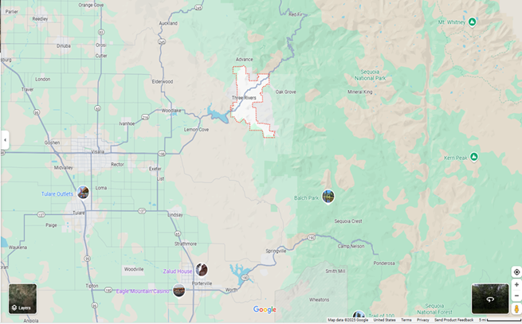

```{r setup, include=FALSE}
knitr::opts_chunk$set(echo = TRUE)
```
<!--  \hspace{3 in}  -->


Mr. Tony Maguire    
Senior Wetland Biologist    
EBI Consulting   
21 B Street  
Burlington, MA 01803  

Subject:	Informal Endangered Species Consultation for the Telecommunications Facility Project, Three Rivers, Tulare County, California

Dear Mr. Maguire:  

This letter is in response to your July 22, 2015 request to initiate informal consultation with the U.S. Fish and Wildlife Service (Service) on the proposed Verizon Wireless Telecommunications Facility Project (proposed project).  The Project site is located on 41541 South Fork Drive in the city of Three Rivers, Tulare County, California. This response is provided under the authority of the Endangered Species Act of 1973, as amended (16 U.S.C. 1531 et seq.) (Act), and in accordance with the implementing regulations pertaining to interagency cooperation (50 CFR 402).

Your email received on August 11, 2015 requested concurrence that the proposed project may affect, but is not likely to adversely affect the federally threatened California red-legged frog (Rana draytonii). The project does not occur within the boundaries of designated critical habitat for the California red-legged frog.

Verizon Wireless proposes to construct a tower facility on the central portion of the subject property. The tower facility will include a 75 foot monopole tower, an equipment shelter, generator, and associated equipment located within a fenced compound on a 40 foot by 40 foot leased area. Verizon Wireless plans to use an existing dirt access road from South Fork Drive to the tower area within a proposed access and utility easement. Electrical power and telco utility conduits will be pulled from an existing telephone pole and power stanchion west-northwest of the project site and trenched to the proposed lease area within a proposed utility easement. 
The subject property includes one irregular-shaped parcel, consisting of undeveloped land, and totaling approximately 6.55 acres. A small section of the access road/easement also runs through an adjacent property. The area of the proposed installation currently consists of undeveloped grassland interspersed with oak trees.

The California red-legged frog has not been observed in Tulare County, therefore, the extent and distribution of this specie is unknown. The closest California red-legged frog critical habitat is approximately 85 miles southwest of the proposed construction site.

<!--   -->

```{r, echo=F,fig.cap="Three Rivers California Red Legged Frog Study Area", fig.align='center', out.width = '100%'}

```
```{r, echo=FALSE, fig.align='center', out.width = '100%'}
library(readxl)
library(kableExtra)
library(gridExtra)
library(grid)
crlf <- read_excel("California_Red-Legged_Frog.xlsx")
tt <- ttheme_default(colhead = list(fg_params = list(parse=TRUE)))#TO AUTOMATICALLY ADJUST COLUMN WIDTHS
table1 <- tableGrob(crlf, rows = NULL, theme = tt)
grid.draw(table1)
kable(crlf)
#kable(crlf, format = "latex", booktabs = TRUE, caption="California Red Legged Frog Distribution") |>
# kable_styling(full_width = FALSE, latex_options = "striped", "HOLD_position") 

```

```{r, echo=FALSE, eval=FALSE}
tt2 <- ttheme_minimal(colhead = list(fg_params = list(parse=TRUE)))#TO AUTOFIT COLUMNS
table2 <- tableGrob(crlf, rows = NULL, theme = tt2)#include/exclude rownames in tableGrob
grid.draw(table2)
```


```{r, echo=FALSE}
#knitr::include_graphics("mykable.png")
```
Conservation Measures

1. Prior to construction, EBI Consulting biologists will conduct pre-construction surveys.

2. Prior to initial ground disturbance activities, environmental awareness training will be given to all construction personnel by a biologist to brief them on how to recognize California red-legged frog.

3. Trenches will be covered during times of no construction to avoid mortalities of California red-legged frog.

4. All food and food related trash items will be enclosed in sealed trash containers and removed from the site at the end of each day.

5.	Plastic monofilament netting or similar material containing netting shall not be used at the project area because California red-legged frog may become entangled or trapped in it. Acceptable substitutes include coconut coir matting.

6.	If California red-legged frogs are found at any time during project work, construction will stop and the Service shall be contacted immediately at (916) 414-6621 for further guidance. The crew foreman will be responsible for ensuring that crewmembers adhere to the guidelines and restrictions.

7. Vegetation clearing will only occur within the delineated project boundaries. A fence will be constructed to avoid entrance of animals.

\begin{center}
Sincerely,

Field Supervisor    
\end{center}

